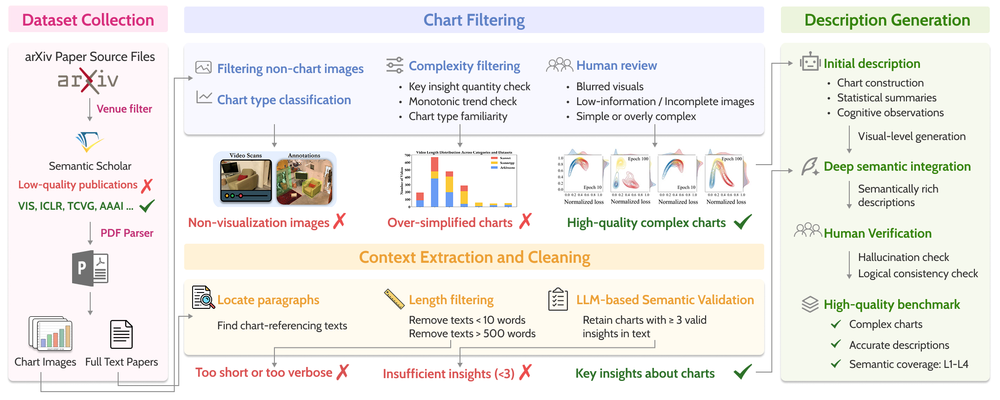
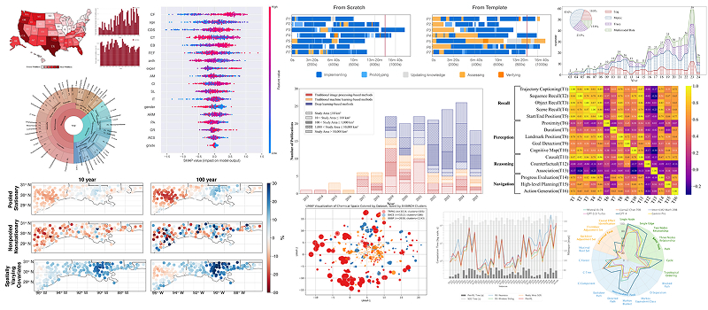

# ChartFI: Benchmarking Faithfulness and Insightfulness of Chart Descriptions from Multimodal Large Language Models

> 🎉 **News**: Our paper has been **accepted by IEEE VIS 2025**!

Chart descriptions are essential for accessibility, cross-modal retrieval, and assisting readers in extracting insights from complex visualizations. As multimodal large language models (MLLMs) are increasingly adopted for automated chart description generation, a critical question arises: how faithfully and insightfully do these models actually describe charts?  Current benchmarks fall short on two fronts: existing datasets consist of simple, homogeneous charts paired with shallow, fact-enumerating descriptions; and prevailing metrics fail to capture the multi-faceted nature of description quality. To address these gaps, we present the Chart Faithfulness and Insightfulness Benchmark (ChartFI-Bench). We first summarize four dimensions that characterize high-quality chart descriptions: factual accuracy, salient feature emphasis, domain-informed guidance, and chart–text complementarity. Guided by these dimensions, we construct a high-quality benchmark comprising 896 chart--description pairs, which feature visually complex charts and semantically rich descriptions. Furthermore, we design four aligned evaluation metrics---Faithfulness, Coverage, Informativeness, and Acuity---to systematically assess the quality of descriptions across these dimensions. Experiments conducted on mainstream MLLMs demonstrate the effectiveness of the proposed framework and reveal common weaknesses among existing models.


## Benchmark

We propose the Chart Faithfulness and Insightfulness Benchmark (ChartFI-Bench) for comprehensively evaluating the faithfulness and insightfulness of chart descriptions generated by MLLMs. We collect charts from arXiv and apply a systematic filtering pipeline followed by manual verification, ultimately obtaining 896 chart–description pairs comprising visually complex charts and semantically rich descriptions.



## Evaluation Metric

We propose a comprehensive evaluation framework comprising four metrics—Faithfulness, Coverage, Informativeness, and Acuity—to rigorously assess the faithfulness and insightfulness of chart descriptions. The proposed metrics show high consistency with expert judgments across 80 samples, as measured by the SRCC values presented in the table below.

| Evaluators           | Faithfulness | Coverage | Informativeness | Acuity |
| :------------------- | :----------: | :------: | :-------------: | :----: |
| Our method vs. Human |    0.809     |  0.785   |      0.786      | 0.858  |
| Expert vs. Expert    |    0.857     |  0.800   |      0.800      | 0.829  |

## Results from Existing Models

Performance comparison across models on reference-based metrics and ChartFI.

| Model                 |    BLEU    |   METEOR   | ROUGE      |   BLEURT    | Faithfulness |  Coverage  | Informativeness |   Acuity   |
| :-------------------- | :--------: | :--------: | ---------- | :---------: | :----------: | :--------: | :-------------: | :--------: |
| GPT-5.4               | **0.0731** |   0.2894   | **0.2206** |   -0.4832   |  **0.9501**  | **0.3358** |   **0.3188**    | **3.1233** |
| Gemini-3-Flash        |   0.0723   | **0.3076** | 0.2163     | **-0.4342** |    0.9471    |   0.3145   |     0.2762      |   3.0719   |
| Claude-Sonnet-4.6     |   0.0651   |   0.2852   | 0.2139     |   -0.4870   |    0.8712    |   0.3038   |     0.3033      |   2.8919   |
| Qwen3.5-plus          |   0.0615   |   0.2821   | 0.1939     |   -0.4803   |    0.8638    |   0.3059   |     0.2854      |   2.9930   |
| Qwen3.5-27B           |   0.0574   |   0.2687   | 0.1938     |   -0.4849   |    0.8591    |   0.2901   |     0.2747      |   2.8249   |
| Llama-4-Scout-17B-16E |   0.0450   |   0.2541   | 0.1915     |   -0.4745   |    0.7348    |   0.2539   |     0.3058      |   2.1833   |
| InternVL3.5-14B       |   0.0538   |   0.2578   | 0.2001     |   -0.4764   |    0.8134    |   0.2461   |     0.2667      |   1.7589   |


## Todo List

- [x] Open-source benchmark dataset
- [ ] Open-source evaluation code
- [ ] Expand the dataset scale and diversity


## Citation

If you find that ChartInsighter helps your research, please consider citing it:

```
@article{wang2026chartfi,
  title={ChartFI: Benchmarking Faithfulness and Insightfulness of Chart Descriptions from Multimodal Large Language Models},
  author={Wang, Fen and Shao, Zekai and Kang, Qiman and Hu, Chunran and Zhang, Zhixuan and Xie, Lexu and Liu, Chao and Chen, Siming},
  journal={arXiv preprint arXiv:2605.23694},
  year={2026}
}
```
